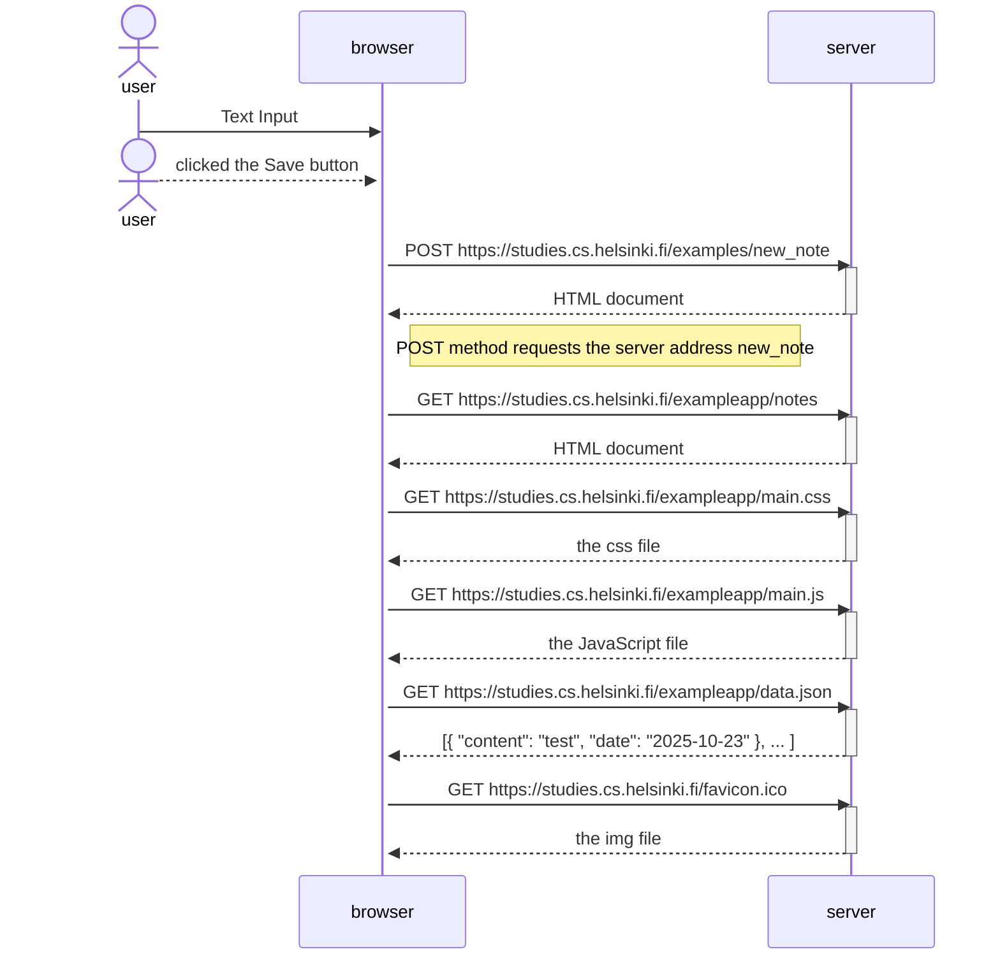

```mermaid
sequenceDiagram
    actor user
    participant browser
    participant server

    user->>browser: Text Input
    activate browser
    destroy user
    user-->>browser: clicked the Save button
    
    browser->>server: POST https://studies.cs.helsinki.fi/examples/new_note
    activate server
    server-->>browser: HTML document
    deactivate server

    Note right of browser: POST method requests the server address new_note
    
    browser->>server: GET https://studies.cs.helsinki.fi/exampleapp/notes
    activate server
    server-->>browser: HTML document 
    deactivate server

    browser->>server: GET https://studies.cs.helsinki.fi/exampleapp/main.css
    activate server
    server-->>browser: the css file 
    deactivate server

    browser->>server: GET https://studies.cs.helsinki.fi/exampleapp/main.js
    activate server
    server-->>browser: the JavaScript file 
    deactivate server

    browser->>server: GET https://studies.cs.helsinki.fi/exampleapp/data.json
    activate server
    server-->>browser: [{ "content": "test", "date": "2025-10-23" }, ... ] 
    deactivate server

    browser->>server: GET https://studies.cs.helsinki.fi/favicon.ico
    activate server
    server-->>browser: the img file
    deactivate server

```
